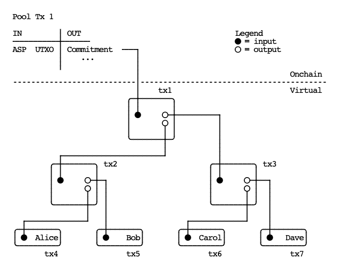

## Ark explainer

### Transactions

**Note:** In an optimistic scenario, transactions marked with a **\*** should never hit onchain

##### Funding transaction

- When Alice wants to enter the Ark

| Inputs              | Outputs (locking script)            |
| ------------------- | ----------------------------------- |
| Alice’s segwit UTXO | `(Alice + ASP) or (ASP in 1 month)` |

##### Redeem transaction \*

- Insurance for Alice, in case the ASP stops responding
- Allows Alice to receive funds back from the Ark

| Inputs                                     | Outputs                                |
| ------------------------------------------ | -------------------------------------- |
| Funding transaction spending `Alice + ASP` | `(Alice + ASP) or (Alice in 24 hours)` |

##### Forfeit transaction \*

- Insurance for the ASP, in case Alice tries to double spend her VTXO after spending it inside Ark
- Before the ASP funds Bob’s VTXO in the next Pool transaction, he must receive this transaction signed by Alice
- Uses a connector from the next Pool transaction to achieve atomicity

| Inputs                                    | Outputs |
| ----------------------------------------- | ------- |
| Redeem transaction spending `Alice + ASP` | `ASP`   |
| Connector from next Pool transaction      |

##### Pool transaction (aka Ark transaction)

- Funded by the ASP, creates VTXOs
- After 4 weeks, the ASP can get their funds back
- Multisig `n-of-n` where `n` is the number of participants
- A new transaction is broadcasted every 5 seconds

| Inputs   | Outputs                                     |
| -------- | ------------------------------------------- |
| ASP UTXO | Shared output: `n-of-n or (ASP in 1 month)` |

##### Shared output (aka Shared UTXO)

- Represents a binary tree of transactions
- In an optimistic scenario, this tree is never revealed

##### VTXO \*

- Similar to Redeem transaction
- Can be broadcasted anytime, on the condition that previous transactions on the transaction tree (up to the Pool transaction) are confirmed or broadcasted at the same time

| Inputs                                  | Outputs                                |
| --------------------------------------- | -------------------------------------- |
| Previous transaction on the binary tree | `(Alice + ASP) or (Alice in 24 hours)` |

### Timeline

##### Boarding the Ark

1. Alice creates a [Funding transaction](#funding-transaction):
   - adds any segwit output as an input (<u>must be segwit</u>)
   - adds output locked by `(Alice + ASP) or (ASP in 1 month)`
   - sends it to ASP, not signed
2. Alice receives a [Redeem transaction](#redeem-transaction-) from the ASP:
   - signed by the ASP, spends Funding transaction (1) via `Alice + ASP`
   - has one output locked by `(Alice + ASP) or (Alice in 24 hours)`
3. Alice signs and broadcasts Funding transaction (1)
4. ASP (with Alice) prepares next [Pool transaction](#pool-transaction-aka-ark-transaction)
5. Alice creates a [Forfeit transaction](#forfeit-transaction-):
   - spends from Redeem transaction (2) via `Alice + ASP`
   - adds connector output from Pool transaction (4) as input
   - signs (SIGHASH_ALL) and sends it to the ASP
6. ASP broadcasts [Pool transaction](#pool-transaction-aka-ark-transaction) (4)
7. Alice has now a [VTXO](#vtxo)
8. After 1 month ASP spends Funding transaction (1) via `ASP in 1 month`

##### Payment to Bob

1. Alice tells ASP to send [VTXO](#vtxo) to Bob
2. ASP (with Alice) prepares next [Pool transaction](#pool-transaction-aka-ark-transaction)
3. Alice creates a [Forfeit transaction](#forfeit-transaction-):
   - spends from VTXO (1) via `Alice + ASP`
   - adds connector output from Pool transaction (2) as input
   - signs (SIGHASH_ALL) and sends it to the ASP
4. ASP broadcasts [Pool transaction](#pool-transaction-aka-ark-transaction)
5. Bob has now a new [VTXO](#vtxo)
6. For at most 4 weeks, Alice will be able to double spend her’s [VTXO](#vtxo), but if she does it, the ASP will have time to grab the funds from the [VTXO](#vtxo) to itself using the [Forfeit transaction](#forfeit-transaction-)

##### Exiting the Ark

1. Alice tells ASP she wants to trade [VTXO](#vtxo) for UTXO
2. ASP (with Alice) prepares next [Pool transaction](#pool-transaction-aka-ark-transaction):
   - an additional output is added, locked by `Alice in 24 hours`
3. Alice creates a [Forfeit transaction](#forfeit-transaction-):
   - spends from VTXO (1) with `Alice + ASP`
   - adds connector output from Pool transaction (2) as input
   - signs it and send it to the ASP
4. ASP broadcasts [Pool transaction](#pool-transaction-aka-ark-transaction)
5. Alice has now a new UTXO, spendable in 24 hours
6. For at most 4 weeks, Alice will be able to double spend her’s [VTXO](#vtxo), but if she does it, the ASP will have time (24 hours) to grab the funds from the [VTXO](#vtxo) to itself using the [Forfeit transaction](#forfeit-transaction-)

