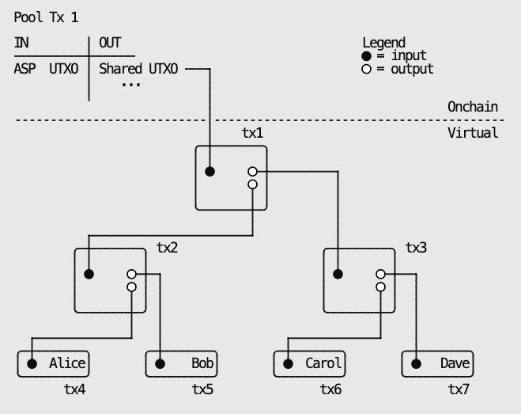

## Ark explainer

### Transactions

##### Funding transaction

- When Alice wants to enter the Ark.

| Inputs              | Outputs (locking script)          |
| ------------------- | --------------------------------- |
| Alice’s segwit UTXO | (Alice + ASP) or (ASP in 1 month) |

##### Redeem transaction \*

- Allows Alice to receive funds back from the Ark.

| Inputs                                           | Outputs                             |
| ------------------------------------------------ | ----------------------------------- |
| Funding transaction  spending `Alice + ASP` | (Alice + ASP) or (Alice in 1 month) |

##### Forfeit transaction \*

- Insurance for the ASP, in case Alice tries to double spend her VTXO after spending it inside Ark.
- Before the ASP funds Bob’s VTXO in the next pool transaction, he must receive this transaction signed by Alice.
- Uses a connector from the next pool transaction to achieve atomicity.

| Inputs                                         | Outputs |
| ---------------------------------------------- | ------- |
| Redeem transaction spending `Alice + ASP` | ASP     |
| Connector from next pool transaction           |

##### Pool transaction (aka Ark transaction)

- Funded by the ASP, creates VTXOs.
- After 4 weeks, the ASP can get their funds back.

| Inputs   | Outputs                                   |
| -------- | ----------------------------------------- |
| ASP UTXO | Shared output: n-of-n or (ASP in 1 month) |

##### Shared output

Represents a binary tree of transactions

##### VTXO \*

- Can be broadcasted anytime
- Similar to Redeem transaction

| Inputs        | Outputs                             |
| ------------- | ----------------------------------- |
| Shared output | (Alice + ASP) or (Alice in 1 month) |

Note: In an optimistic scenario, transactions marked with a **\*** should never hit onchain.

### Timeline

##### Boarding the Ark

1. Alice creates a [funding tx](#funding-transaction):
   - add any segwit output as an input (must be segwit)
   - add output locked by `(Alice + ASP) or (ASP in 1 month)`
   - send it to ASP, not signed
2. Alice receives a [redeem tx](#redeem-transaction-) from the ASP:
   - spends funding tx (1) via `Alice + ASP`
   - has one output locked by `(Alice + ASP) or (ASP in 1 month)`
   - signs and send it to the ASP
3. Alice signs and broadcasts funding tx (1)
4. ASP (with Alice) prepares next [pool tx](#pool-transaction-aka-ark-transaction)
5. Alice creates a [forfeit tx](#forfeit-transaction-):
   - spends from redeem tx (2) via `Alice + ASP`
   - adds connector output from pool tx (4) as input
   - signs and sends it to the ASP
6. ASP broadcasts [pool tx](#pool-transaction-aka-ark-transaction) (4)
7. Alice has now a [VTXO](#vtxo)
8. After 1 month ASP spends funding tx (1) via `ASP in 1 month`

##### Payment to Bob

1. Alice tells ASP to send [VTXO](#vtxo) to Bob
2. ASP (with Alice) prepares next [pool tx](#pool-transaction-aka-ark-transaction)
3. Alice creates a [forfeit tx](#forfeit-transaction-):
   - spends from VTXO (1) via `Alice + ASP`
   - adds connector output from pool tx (2) as input
   - signs it and sends it to the ASP
4. ASP broadcasts [pool tx](#pool-transaction-aka-ark-transaction)
5. Bob has now a new [VTXO](#vtxo)
6. For at most 4 weeks, Alice will be able to double spend her’s [VTXO](#vtxo), but if she does it, the ASP will have time to grab the funds from the [VTXO](#vtxo) to itself using the [forfeit tx](#forfeit-transaction-)

##### Exiting the Ark

1. Alice tells ASP she wants to trade [VTXO](#vtxo) for UTXO
2. ASP (with Alice) prepares next [pool tx](#pool-transaction-aka-ark-transaction):
   - an additional output is added, locked by `Alice in 24 hours`
3. Alice creates a [forfeit tx](#forfeit-transaction-):
   - spends from VTXO (1) via `Alice + ASP`
   - adds connector output from pool tx (2) as input
   - signs it and send it to the ASP
4. ASP broadcasts [pool tx](#pool-transaction-aka-ark-transaction)
5. Alice has now a new UTXO
6. For at most 4 weeks, Alice will be able to double spend her’s [VTXO](#vtxo), but if she does it, the ASP will have time to grab the funds from the [VTXO](#vtxo) to itself using the [forfeit tx](#forfeit-transaction-)
